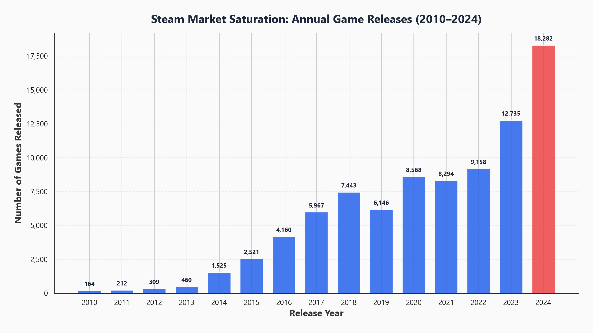
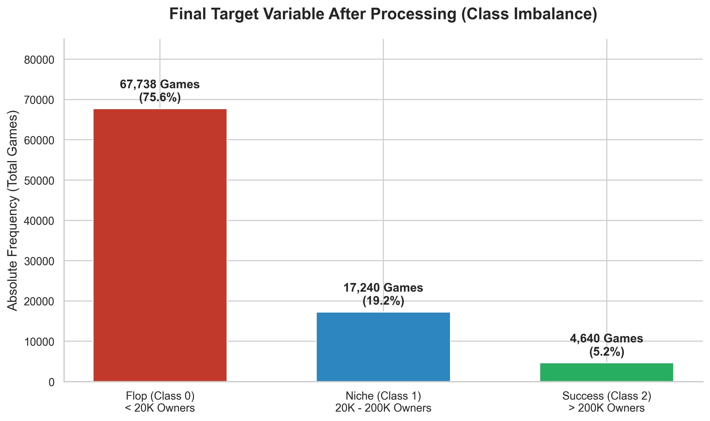
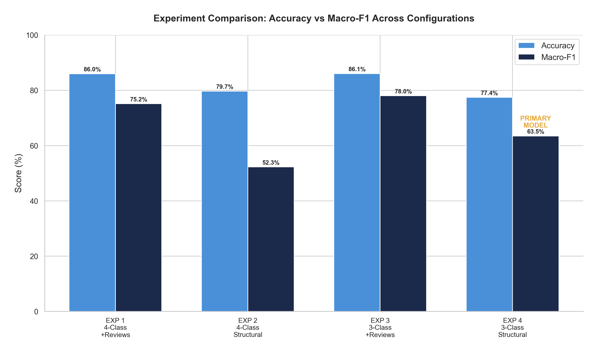
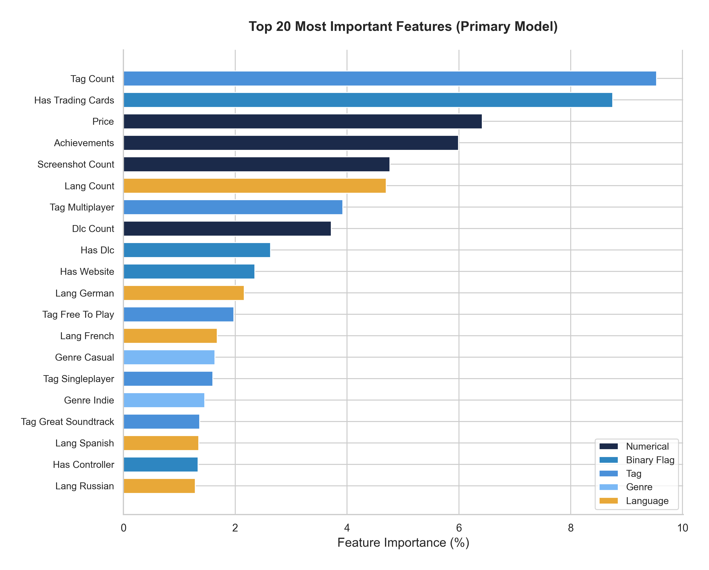
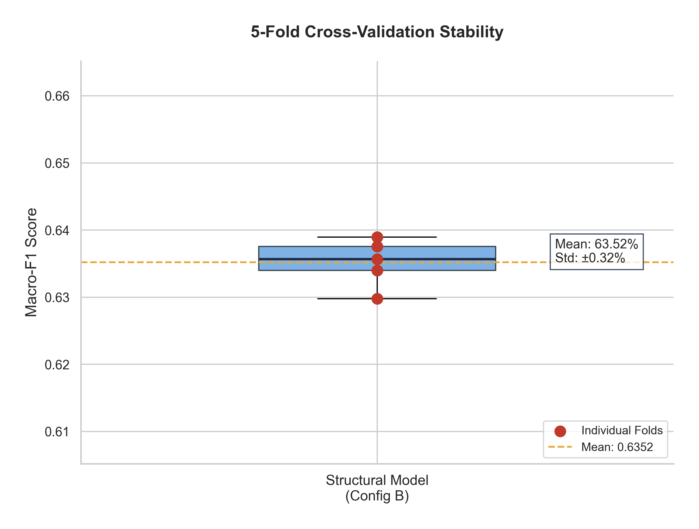
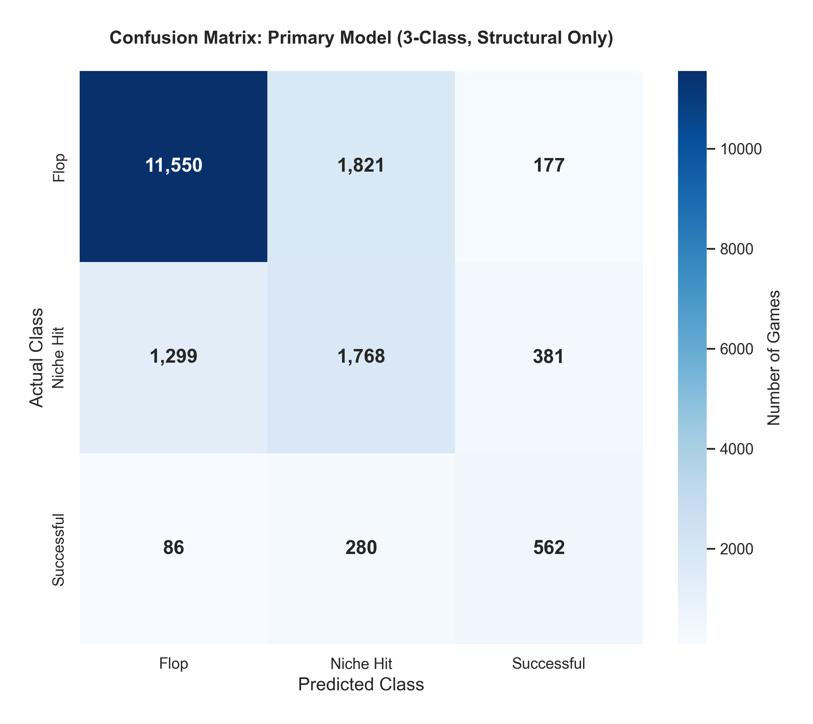
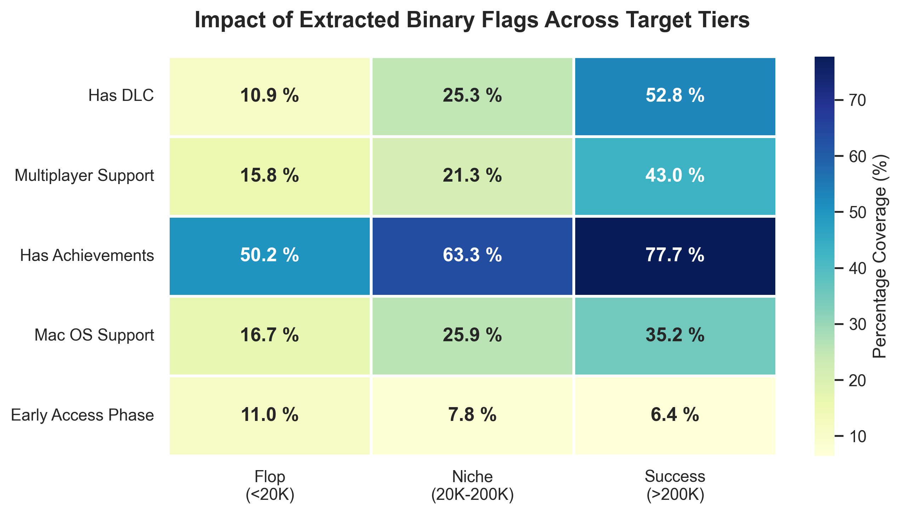
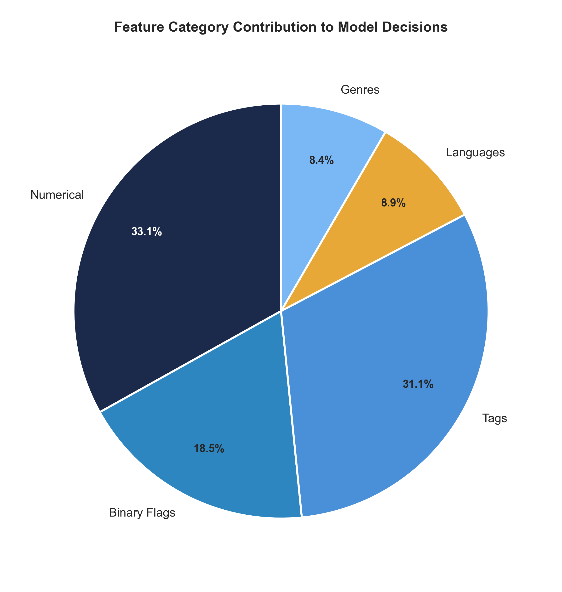

# 🎮 Steam Game Success Predictor

**Predicting Game Success and Identifying Critical Performance Drivers on the Steam Platform: A Machine Learning Approach**

> Bachelor's Thesis — Yeditepe University, Department of Information Systems and Technologies, 2026

[](https://python.org)
[](https://scikit-learn.org)
[](https://flask.palletsprojects.com)

---

## Overview

Can we predict whether a Steam game will succeed **before it launches** — using only features a developer controls during development?

With **18,000+ games released on Steam in 2024** and **75.6% of all games failing commercially** (fewer than 20,000 owners), this thesis builds a **Random Forest classifier** that predicts game success using **62 pre-launch structural features** — no reviews, no player counts, no post-launch data.

### Key Results

| Metric | Value |
|--------|-------|
| **Accuracy** | 77.44% |
| **Macro-F1** | 63.48% |
| **Cross-Validation** | 63.52% ± 0.32% |
| **Features Used** | 62 (all pre-launch) |
| **Dataset** | 89,618 Steam games |

> **Dataset:** [Steam Games Dataset (Artermiloff 2025) on Kaggle](https://www.kaggle.com/datasets/artermiloff/steam-games-dataset)

---

## Data Leakage Proof

Most existing studies use review metrics (review counts, positive review percentages) to predict success. But reviews only exist **after** launch — using them is data leakage.

This thesis proves it with a **controlled 4-experiment comparison:**

| Experiment | Features | Accuracy | Macro-F1 |
|:---:|---|:---:|:---:|
| 1 | 4-class + reviews | 86% | 75% |
| 2 | 4-class structural only | 80% | 52% |
| 3 | 3-class + reviews | 86% | 78% |
| **4 (Primary)** | **3-class structural only** | **77.44%** | **63.48%** |

> **The 14.56-point Macro-F1 gap between Experiment 3 and 4 proves that review metrics are mirrors of sales, not predictors.**

---

## Top Success Drivers

The model identifies which features matter most for commercial success:

| Rank | Feature | Importance | Insight |
|:---:|---------|:---:|---------|
| 1 | **Tag Count** | 9.50% | More tags → more visibility in Steam's recommendation algorithm |
| 2 | **Trading Cards** | 8.80% | Steam ecosystem integration → visibility bonus during sales |
| 3 | **Price** | 6.40% | Monetization strategy signal |
| 4 | **Achievements** | 6.00% | Player engagement and retention |
| 5 | **Screenshot Count** | 4.80% | Store page presentation quality |
| 6 | **Language Count** | 4.70% | Global market reach |

> Every top feature is **developer-controllable before launch** — this is actionable intelligence.

---

## Figures

### Market Saturation


### Target Distribution (Class Imbalance)


### Data Leakage — Experiment Comparison


### Feature Importance (Top 20)


### Cross-Validation Stability


### Confusion Matrix


### Binary Features by Success Tier


### Feature Category Contribution


---

## Project Structure

```
├── data_preprocessing.py        # Data cleaning & feature engineering pipeline
├── model_training.py            # Random Forest training & evaluation
├── model_optimization.py        # Hyperparameter tuning (GridSearchCV)
├── predictor_app.py             # Flask web application
├── templates/
│   └── predictor.html           # Web UI template
├── static/
│   └── predictor_style.css      # Web UI styling
├── generate_all_figures.py      # EDA & methodology visualizations
├── generate_ch5_figures.py      # ML results visualizations
├── generate_fe_eda.py           # Feature engineering analysis
├── generate_appendix.py         # Appendix figures
├── raw_data_eda_script.py       # Raw data exploration
├── test_predictions.py          # Model testing & validation
└── figures/                     # Key result visualizations
```

---

## Web Application

A live prediction tool built with Flask — uses the same Random Forest model with the same 62 features and hyperparameters.

### Features
- **Preset game profiles** — quickly test Small Indie, Mid-Tier, or AAA configurations
- **Custom input** — adjust any of the 62 features manually
- **Instant prediction** — Flop / Niche Hit / Successful with confidence scores
- **Weakness analysis** — identifies which features to improve
- **"What if" scenarios** — test how changes in features affect the prediction

### Run Locally

```bash
# Clone the repository
git clone https://github.com/yemre345561/Steam-Game-Success-Predictor.git
cd Steam-Game-Success-Predictor

# Install dependencies
pip install flask pandas numpy scikit-learn

# Run the application
python predictor_app.py

# Open in browser
# http://127.0.0.1:5000
```

---

## The 62 Features

All features are **pre-launch** — available before the game goes live.

| Category | Count | Examples |
|----------|:-----:|---------|
| Numerical | 7 | price, achievements, tag_count, dlc_count, screenshot_count, required_age, lang_count |
| Binary | 12 | trading_cards, early_access, workshop, controller, multiplayer, coop, website, mac, linux |
| Languages | 8 | Chinese, Japanese, German, French, Russian, Korean, Brazilian Portuguese, Spanish |
| Genres | 10 | Indie, Action, Adventure, RPG, Strategy, Simulation, Casual, Sports, Racing, F2P |
| Tags | 25 | Selected by class-separation power (Multiplayer, Open World, Story Rich, etc.) |

---

## Methodology

1. **Dataset:** 89,618 Steam games with 47 columns (Artermiloff 2025)
2. **Cleaning:** Removed columns with >90% missing data, handled sentinel values (-1 → 0 + flag), removed developer/publisher names (19,460+ unique), removed release year (survivorship bias)
3. **Feature Engineering:** One-hot encoding → 47 raw columns → 22 cleaned → 62 final features
4. **Model:** Random Forest (300 trees, max_depth=25, balanced class weights)
5. **Validation:** 5-fold stratified cross-validation, confusion matrix, feature importance analysis
6. **Leakage Control:** 4-experiment comparison proving review metrics inflate results

---

## Tech Stack

- **Python 3.10+** — core language
- **scikit-learn** — Random Forest, cross-validation, metrics
- **pandas / NumPy** — data processing
- **matplotlib / seaborn** — visualization
- **Flask** — web application

---

## Citation

```
Açıkoğlu, Y. (2026). Predicting Game Success and Identifying Critical Performance 
Drivers on the Steam Platform: A Machine Learning Approach. Bachelor's Thesis, 
Yeditepe University, Department of Information Systems and Technologies.
Supervisor: Prof. Dr. Aşkın Demirağ
```

---

## Author

**Yunusemre Açıkoğlu**  
Yeditepe University — Information Systems and Technologies  
[GitHub](https://github.com/yemre345561) · [LinkedIn](https://www.linkedin.com/in/yunus-emre-açıkoğlu-1479b1203)


